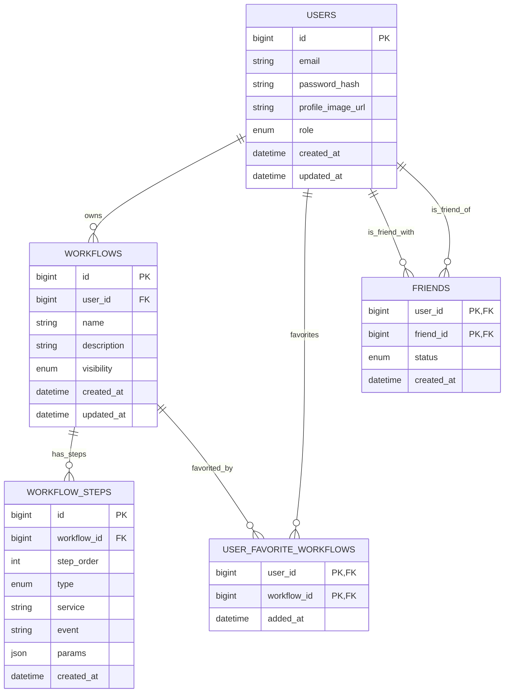

# Area Web Platform

## Overview

The AREA Web Platform is an automation tool inspired by IFTTT and Zapier, designed to connect different online services and make them interact automatically. The goal of the platform is to allow users to create custom workflows, called AREAs, that seamlessly link events from one service to automated actions in another. Instead of performing repetitive digital tasks manually, users can configure the platform to react instantly when certain conditions are met, such as forwarding a received email attachment to cloud storage or posting a social media update across multiple networks at once.

## Database

The platform’s data is stored in a MariaDB relational database, ensuring reliable management of users, workflows, and their relationships.

## Authors

- **Yanis Senovic**
- **Théotime Collier**
- **Lucas Fontana**
- **Corentin Pierrat**
- **Roman Girault**