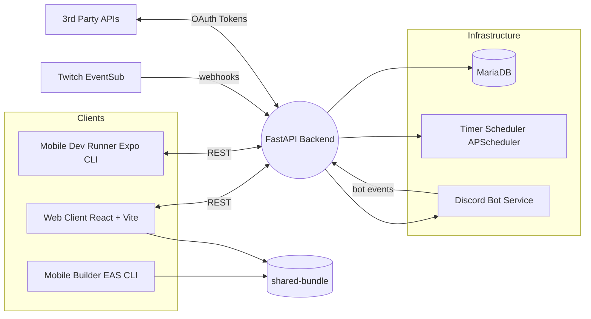
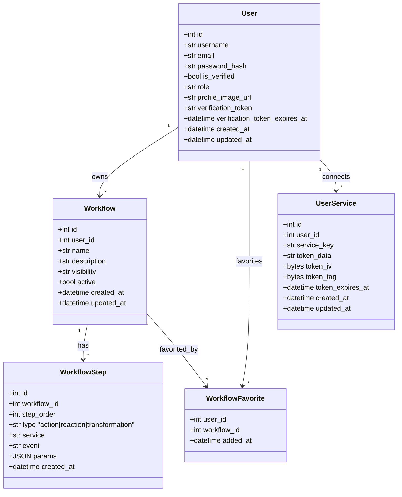

# AREA Automation Platform

> Multi-surface automation suite inspired by IFTTT/Zapier. Compose “AREAs” that connect external events to reactions executed by our FastAPI backend and surfaced through web & mobile clients.

---

## Contents

1. [Overview](#overview)
2. [System Architecture](#system-architecture)
3. [Domain Model](#domain-model)
4. [Getting Started](#getting-started)
5. [Server API Reference](#server-api-reference)
6. [about.json Contract](#aboutjson-contract)
7. [Additional Documentation](#additional-documentation)
8. [Maintainers](#maintainers)

---

## Overview

The AREA platform lets users orchestrate **Actions** (event detectors) and **Reactions** (side effects) across a growing collection of online services. The core backend exposes a REST API consumed by:

- a React/Vite **web client** (port `8081`)
- a React Native/Expo **mobile client** whose Android build artifacts are shared with the web app
- background schedulers and bots that subscribe to external webhooks
- a Python 3.12 **FastAPI** backend that exposes the REST surface and orchestrates business logic

**Feature highlights**

- JWT-secured authentication with email verification and OAuth account linking (Google, Spotify, Twitch, Discord, Faceit, Twitter/X).
- Visual workflow builder: chain an Action to one or many Reactions with ordered steps.
- Hook engine capable of ingesting Discord/Twitch webhooks and recurring timers.
- Public feed of reusable workflows plus cloning into a personal library.
- Admin endpoints for user management and insight dashboards.

---

## System Architecture



The `docker-compose.yml` definition wires those services together:

- `server` – FastAPI backend exposed on **8080** with an `/about.json` manifest.
- `client_mobile` – EAS builder producing `client.apk` into the `shared-bundle` volume.
- `mobile_dev` – optional Expo development server mapped to port **19000**.
- `client_web` – Vite dev server on **8081** serving the SPA and exposing `client.apk` from the shared volume.

---

## Domain Model

Application state is persisted in MariaDB via SQLAlchemy models. The following class diagram focuses on the most important aggregates manipulated by the API.



> For a full ER view (including friendship edges) refer to the `documentation/AREA_documentation.pdf`.

---

## Getting Started

### Prerequisites

- Docker Engine **24+** and Docker Compose plugin.
- Node.js **20+** and npm (local web/mobile development).
- Python **3.12** (if you intend to run the backend outside Docker).
- MariaDB instance (containerised in production deployment).

### Clone & bootstrap

```bash
git clone https://github.com/<your-org>/mirrorBeforeDefense6.git
cd mirrorBeforeDefense6
```

1. **Backend environment**
   ```bash
   cp backend/.env.example backend/.env
   ```
   Fill in database credentials, JWT secret, SMTP sender, and OAuth client IDs/secrets (Spotify, Twitch, Discord, Faceit, Google, Twitter).  
   Optional: set `MEDIA_ROOT`/`MEDIA_URL` or leave defaults (`backend/uploads`).

2. **Frontend environment**
   - `frontend/.env` expects at least `VITE_API_URL=http://localhost:8080`.

3. **Mobile environment**
   - `mobile/app.json` already reads Expo project metadata.
   - Add an Expo access token (`EXPO_TOKEN`) to the Compose file or local shell for EAS builds.

### Run the full stack with Docker

```bash
docker compose up --build
```

Services exposed locally:

| Service         | URL / Port           | Notes |
|-----------------|----------------------|-------|
| Backend API     | `http://localhost:8080` | `/about.json`, `/docs` (Swagger) |
| Web client      | `http://localhost:8081` | React SPA + APK download (`/client.apk`) |
| Expo dev server | `http://localhost:19000` | Optional development QR code |

The shared volume `shared-bundle` hosts `client.apk` built by `client_mobile` and served by the web container.

### Local development without Docker

**Backend**
```bash
cd backend
python -m venv .venv
source .venv/bin/activate
pip install -r requirements.txt
uvicorn app.main:app --reload --port 8080
```

**Web client**
```bash
cd frontend
npm install
npm run dev -- --host --port 8081
```

**Mobile client**
```bash
cd mobile
npm install
npm run start  # Expo CLI (requires Expo Go app or simulator)
```

### Testing

- Backend automated checks live under `tests/backend` and can be run with `pytest`.
- Frontend linting: `npm run lint`.
- Mobile unit/UI tests use the Cypress suite in `mobile/cypress`.

---

## Server API Reference

The full OpenAPI specification is available at `http://localhost:8080/docs`. The table below highlights the endpoints exposed by each router.

| Area | Method & Path | Description |
|------|---------------|-------------|
| **Health** | `GET /` | Basic heartbeat. |
| **Profile** | `GET /about.json` | Required AREA manifest containing services, actions and reactions. |
| **Auth** | `POST /auth/register` | Create account and send 6-digit email verification code. |
| | `POST /auth/verify` | Confirm registration with email + code. |
| | `POST /auth/login` | Obtain JWT access token. |
| | `GET /auth/me` | Retrieve current user (requires `Authorization: Bearer <token>`). |
| | `PATCH /auth/change-password` | Change password after verifying current credentials. |
| | `POST /auth/me/profile-image` | Upload profile image (PNG/JPEG/WEBP ≤5 MB). |
| | `DELETE /auth/me` | Delete account and cascade workflows. |
| **OAuth linking** | `GET /oauth/{provider}/login` | Redirect to provider (spotify, twitch, discord, faceit, google, twitter). Accepts optional user token to link an existing session. |
| | `GET /oauth/{provider}/callback` | Handles OAuth exchange, persists encrypted tokens, returns redirect with JWT. |
| | `GET /oauth/{provider}/status` | (Implemented in services layer) Check connection status per provider. |
| | `DELETE /oauth/{provider}/disconnect` | Remove stored token and webhooks. |
| **Catalog** | `GET /catalog/actions` | Available actions with schema & availability flag (token based). |
| | `GET /catalog/reactions` | Available reactions with schema & availability. |
| **Workflows** | `GET /workflows/` | List authenticated user's workflows. |
| | `POST /workflows/` | Create workflow with ordered steps. |
| | `PUT /workflows/{id}` | Replace workflow definition (recreates steps). |
| | `PATCH /workflows/{id}/toggle` | Enable/disable workflow. |
| | `DELETE /workflows/{id}` | Remove workflow and deregister external hooks. |
| | `POST /workflows/test-step` | Execute a single action/reaction for quick validation. |
| **Feed** | `GET /feed/workflows` | Public workflows feed. Supports `?service=discord` filter, pagination with `skip`/`limit`. |
| **Admin** | `GET /admin/users` | Admin-only list of all users. |
| | `POST /admin/users` | Create user with selected role. |
| | `PATCH /admin/users/{id}` | Update identity or role. |
| | `DELETE /admin/users/{id}` | Remove user. |
| | `GET /admin/stats` | High-level metrics (users, active workflows, services, signups). |
| **Hooks** | `POST /actions/discord` | Internal webhook invoked by our Discord bot. Validates `BOT_SECRET`. |
| | `POST /actions/twitch` | Twitch EventSub webhook endpoint with HMAC verification. Handles challenge flow. |

**Authentication**

- Most endpoints require the `Authorization: Bearer <JWT>` header.
- Admin routes additionally call `get_current_admin_user`, checking the `role` field.

**Error handling**

- Human-readable error messages live in the `detail` field.
- Validation errors follow FastAPI’s standard `422 Unprocessable Entity` schema.

---

## about.json Contract

`/about.json` must respond with the schema expected by AREA juries:

```json
{
  "client": { "host": "127.0.0.1" },
  "server": {
    "current_time": 1735862622,
    "services": [
      {
        "name": "discord",
        "actions": [{ "name": "member_join", "description": "A member joins the Discord server" }],
        "reactions": [{ "name": "send_message", "description": "Send a message via the Discord bot" }]
      }
    ]
  }
}
```

The router dynamically builds this list from `ACTIONS_CATALOG` and `REACTIONS_CATALOG`, so adding a new entry there automatically surfaces it in the manifest.

---

## Additional Documentation

- `documentation/AREA_documentation.pdf` – detailed technical report and design rationales.
- `documentation/USER_GUIDE.md` – functional tour for end users.
- `documentation/CONTRIBUTING.md` – legacy contribution notes (superseded by the new [`HOWTOCONTRIBUTE.md`](HOWTOCONTRIBUTE.md)).

---

## Maintainers

- **Yanis Senovic**
- **Théotime Collier**
- **Lucas Fontana**
- **Corentin Pierrat**
- **Roman Girault**
